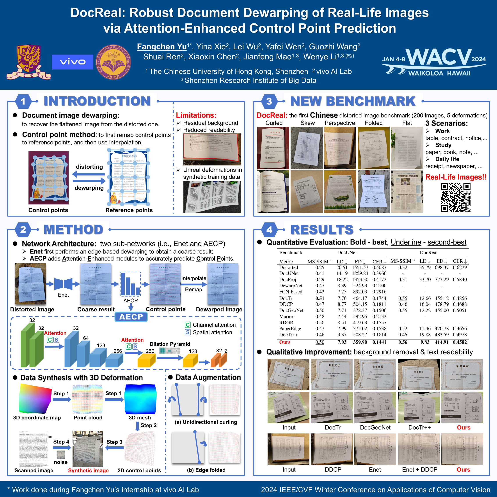

# WACV2024-DocReal

The source code for the WACV'2024 paper titled "**DocReal: Robust Document Dewarping of Real-Life Images via  Attention-Enhanced Control Point Prediction**".

## Introduction

This Github repository contains *the first Chinese distorted image benchmark*, i.e., ***DocReal***, designed for a wide range of Chinese real-life document image scenarios.

- **3 Scenarios**: DocReal includes 10 subscenarios across 3 significant scenarios: work, study, and daily life. The **work** scenario includes tables, contracts, and notices, while the **study** scenario includes papers, books, tests, and notes. The **daily life** scenario includes receipts, certificates, and newspapers. All these sub-scenarios cover the vast majority of usage scenarios in Chinese people’s daily lives..

- **5 Deformations**: Each sub-scenario contains five different contents, and for each content, there are four distorted images with varying types of deformation, shooting angles, and shooting distances. The deformation types include curled, perspective, skew, folded, and flat, commonly encountered in real-life document images.

In total, DocReal contains 200 images within five classes, each representing a different deformation type to facilitate qualitative comparisons, providing a comprehensive and diverse dataset for researchers in the field of document image dewarping.

## Method

<p align="center">
    
</p>

## DocReal Benchmark!!!
You can download DocReal through the following links.  </br>
+ Google Drive: [ https://drive.google.com/file/d/1fxdUMMCQoTxc-THv1LmO-Ye8XjMyPK--/view?usp=sharing](https://drive.google.com/file/d/1fxdUMMCQoTxc-THv1LmO-Ye8XjMyPK--/view?usp=drive_link)

## Rectified Results

This work was done during Fangchen Yu’s internship at vivo AI Lab. Due to commercial restrictions, we are unable to provide the source code currently. Instead, we will provide a demo API in the future, allowing for further exploration and optimization by the research community.

You can obtain **our rectified results for DocUNet and DocReal** through the following links. </br>
+ Google Drive: [https://drive.google.com/file/d/1i0LMai40OBl-tit92KKFNg9CnXXKZv6d/view?usp=sharing](https://drive.google.com/file/d/1i0LMai40OBl-tit92KKFNg9CnXXKZv6d/view?usp=drive_link)


## Citation

If you find this code useful for your research, please use the following BibTeX entry.

```
@inproceedings{yu2024docreal,
  title={DocReal: Robust Document Dewarping of Real-Life Images via Attention-Enhanced Control Point Prediction},
  author={Yu, Fangchen and Xie, Yina and Wu, Lei and Wen, Yafei and Wang, Guozhi and Ren, Shuai and Chen, Xiaoxin and Mao, Jianfeng and Li, Wenye},
  booktitle={Proceedings of the IEEE/CVF Winter Conference on Applications of Computer Vision},
  pages={665--674},
  year={2024}
}
```

## Contact

If you have any problems or questions, please contact the author: Fangchen Yu (email: fangchenyu@link.cuhk.edu.cn)

